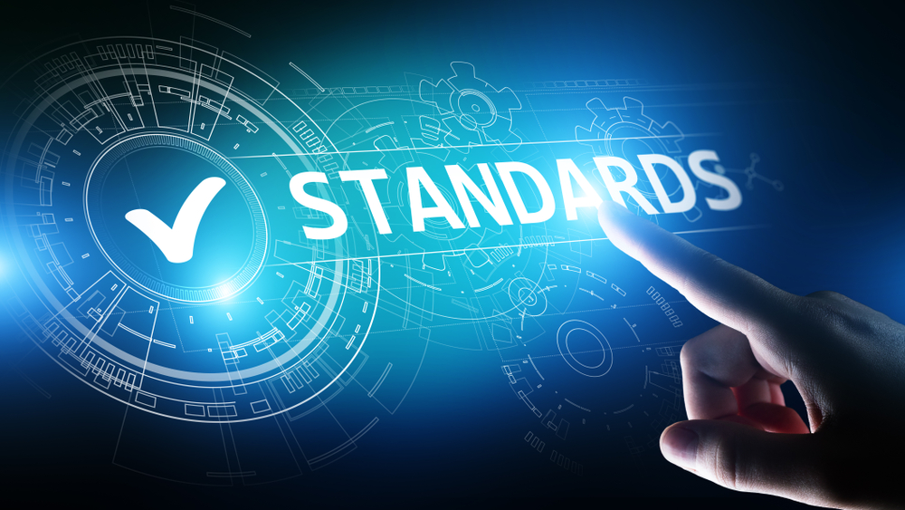

*Why standards are important*

## Introduction

Have you ever tried making tikka masala from scratch? Sure you can look up the ingredients, throw them in a pot, and have something to eat after, but will it be the same as if you went to your favorite Indian restaurant? There’s a reason restaurants follow recipes. If that restaurant opened a chain and served you food in California wouldn’t you expect the same quality and taste as the one in New York? Occasionally a restaurant may hire an outstanding Michelin Star chef who can actually improve a dish, but then that chef’s style would likely end up incorporated into the recipe so that a minimum wage cook can make it in any one of the restaurant’s chains. This same philosophy is used in coding to uphold and enforce standards within an organization.

What does the following code do?

```
function f(a:number):number{let b=1;for(let i=1;i<=a;i++){b*=i;}return b;}
```

## Why standards are important

It calculates the factorial of an input number, however with poor variable and function names, no comments, and trying to do everything on one line it is hard to tell at a glance what it is doing.

Compare that version to the following version:

```
/**
 * Calculates the factorial of a given number.
 * @param num The number for which the factorial is calculated.
 * @returns The factorial of the number.
 */
function calculateFactorial(num: number): number {
    let result = 1;

    // Loop through all numbers from 1 to num
    for (let i = 1; i <= num; i++) {
        result *= i;
    }

    return result;
}
```

Functionally both of these programs work the same and will return the same value, however the second version is much easier to read for a human being. When it comes to working for an organization it is important to implement a standard way to write code so that any other person working with your source code can make sense of it. If I’m cooking tikka masala at my own house I know where my ingredients are, what spices I have without labeling them, and what quantities I want to use. If I’m cooking tikka masala at my friend’s house for a larger group then at the very least I would like everything to be clearly labeled, what quantities of spices to use, and how big the portions should be. When writing code for a company you are not cooking in your own house. You’re cooking in the company’s house and someone else might have to jump in to finish, add to, or utilize your work. Enforcing a standard helps keep clarity, uniformity, and repeatability of work done at any organization.

## Conclusion

Imagine jumping into a project mid-way through with thousands of lines of code already written and your job is to debug or fix an error. If there wasn’t a standard, even just a basic standard enforcing variable/function names, then your job could become unnecessarily difficult because now you’re trying to read the mind of the person who wrote the code instead of it being easy to read on your own. In conclusion I hope this short essay helps you appreciate the importance of using coding standards. Whether it’s something that may seem trivial such as using 2 spaces for indents vice 4 spaces, to something more complicated like declaring variable types and naming them appropriately, enforcing and complying with coding standards can turn a home kitchen into a 5 star restaurant chain.
