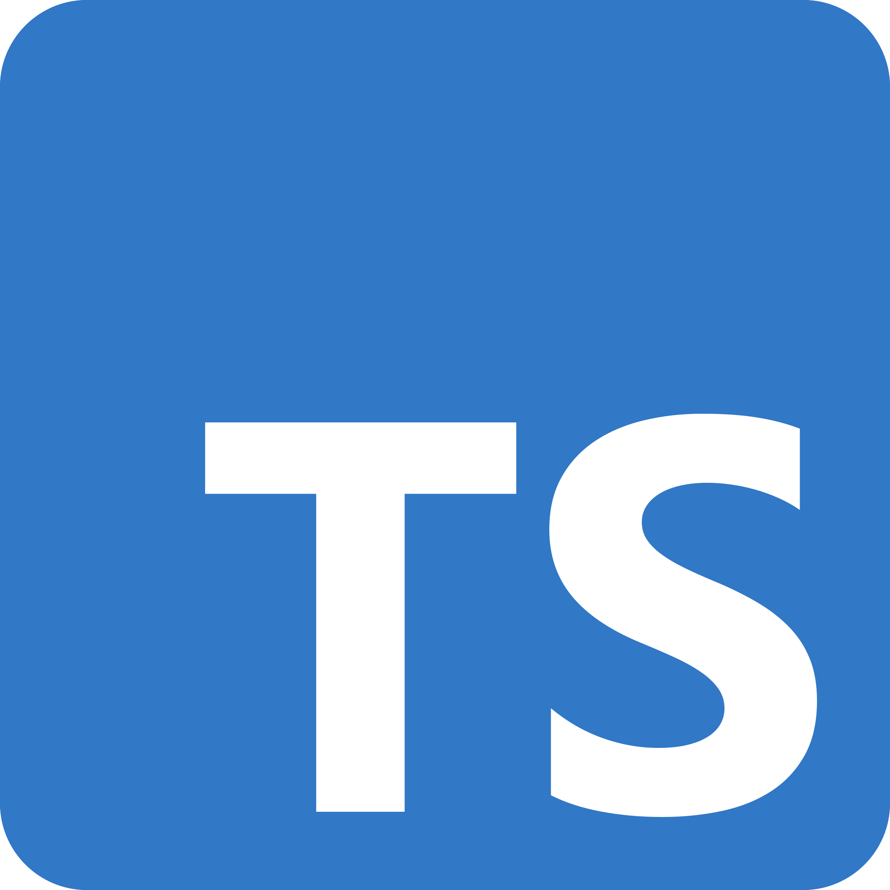

  Typescript is an interesting programming language to learn. So far I like using it since it doesn’t require downloading a code editor and compiler with 99% of the features going unused. It’s as simple as opening the web browser and start coding. I don't have to worry about project file paths or naming. I don't have to worry about incorrect file declarations, at least for now. With typescript it's easy to use without having to read a whole tech manual before even opening the editor. It's even simpler to start and use then 1980's unix, and it can provide real-time error analysis.

  When it comes to the actual implementation of code itself typescript and C are both fairly similar. They both use type declarations, however typescript does allow for more flexibility such as allowing unknown types. Typescript does not require compiler directives or pre-processing like C does which simplifies the compiling process, at least on the human side of things. As a final note, typescript ability to be shared is more intuitive then that of trying to share C source code. All you have to do is share the link to the code then a collaborator can instantly see any compile errors, run the code, and start testing. While in C, depending on the IDE used, you might have to copy the code to a text file, send that text file which would then have to be copied into an editor, compile the program, then run and test. It may only be a few extra steps but when collaborating with large groups on large projects those few extra steps could waste dozens of hours that could have been utilized refining the code. Ultimately typescript from a software engineering perspective is more beneficial than using other source languages such as C, C++, or JAVA.

  I found the practice WODs useful. They provide an engaging way to test material. It can be stressful worrying about the time requirements for them but ultimately that will facilitate growth. I think this style of learning will work for me.
