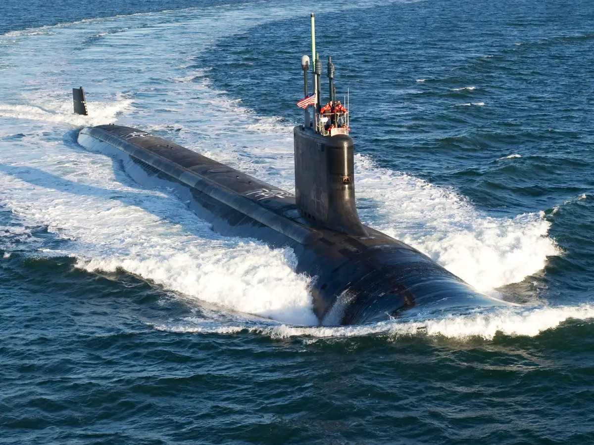

In 2020 the DOD made a push to convert all physical records into electronic records. For my department we retain records for the lifetime of a vessel. Initial conversion of past
records was fairly simple, just scanning in documents to upload as PDF files, but an entirely new system needed to be created for future records. Every week, hundreds of radiological
surveys are recorded on pen and paper and analyzed for trends. The new system, which is currently implemented nation-wide, allows the use of tablets with a program that utelizes 
stencils to draw technically accurate system components, record radiological data and other pertinent information, and upload that data to cloud servers. I was not involved with
the implementation of the code, but I was heavly involved with the rigourous testing and improvements to functionality.

```
