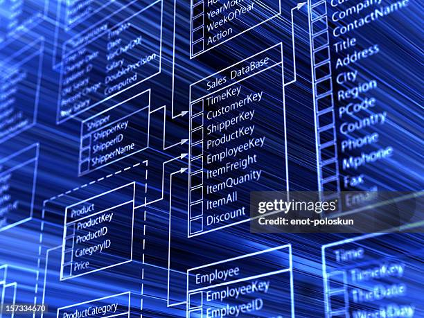

I implemented a program in both C and C++ that uses a user interface to input accounts into a database of linked lists. The user interface
allows the user to add a new record, delete a record, search for a record, and print all records with both a debug and normal mode of operation. 
Below is the getaddress function of the code used.

```

void getaddress(char address[], int max) 
{
    int i = 0;
    char c;
    bool last_was_newline = false;

    while (i < max - 1) 
    {
        c = std::cin.get();
        if (c == '\n') {
            if (last_was_newline) 
            {
                break; 
            }
            last_was_newline = true;
        } else {
            last_was_newline = false;
        }

        if (c != EOF) 
        {
            address[i++] = c;
        }
    }
    address[i] = '\0';

#ifdef DEBUG
    std::cout << "Debug: Address entered: " << address << std::endl;
#endif
}
